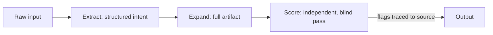

# Amruth Charmana M

**3x Founder · 14+ years building B2B SaaS · VP of Product, FinTech · Shipping AI systems in the open**

I build products, I don't just spec them. This page is the evidence layer — real career outcomes on one side, real code on the other, kept honestly separate.

📍 Bengaluru · [amruth.space](https://amruth.space) · [LinkedIn](https://linkedin.com/in/1amruth)

---

### Contents
- [Track record](#track-record)
- [What I actually think about](#what-i-actually-think-about)
- [Shipped](#-shipped)
- [Building next](#-building-next)
- [Career](#career)
- [Press & recognition](#press--recognition)
- [Education & certifications](#education--certifications)
- [How I operate](#how-i-operate)
- [Get in touch](#get-in-touch)

---

## Track record

| | |
|---|---|
| **$2.3M** raised across 3 rounds | **9** B2B SaaS products shipped, **3** acquired by strategic buyers |
| **$1.8M** new ARR driven in <2 years (current role) | **$1M** in agentic-AI project revenue (current role) |
| **80+** person cross-border team led (Squadway) | **1,200+** business accounts on an acquired CRM |
| **5,000+** concurrent users on an acquired assessment platform | **14+ years**, zero-to-one through to exit |

*Acquisitions are under NDA on buyer identity — the metrics above are what made them acquirable, and that part I can talk about in as much depth as anyone wants.*

---

## What I actually think about

Six things I have an actual point of view on, not just a working definition of. Click to expand.

<b>LLM evals in regulated environments</b>

 
Most public writing on evals assumes a consumer app where a wrong answer costs you a bad review. In banking-adjacent AI, a wrong answer costs someone a loan they shouldn't get or a compliance breach that costs a license. That changes the eval design: you don't just score output quality, you score <i>groundedness</i> — can every claim the model made be traced back to a source document — and you keep the scoring pass architecturally blind to the generation pass's reasoning, so it can't rubber-stamp itself. That single design choice (independent, blind verification) is the pattern running through every AI system I've shipped, and it's the pattern in <code>prd-chain</code> below.

<b>Zero-to-one & PLG — knowing when to kill, not just when to build</b>

 
Nine products built, three acquired, the rest killed or pivoted on purpose. The skill that mattered more than any single launch was running a kill-criteria discipline set <i>before</i> building, not after — a defined window and a defined bar, so a failing product gets killed on schedule instead of on morale. Growth-hacking gets taught constantly; the discipline of walking away from a product that isn't working, on time, almost never does.

<b>GTM execution in constrained, unglamorous markets</b>

 
The GTM playbooks that get written are almost all consumer-PLG or enterprise-top-down. SME banking is neither — it's relationship-led, compliance-gated, and the buyer and the user are rarely the same person. Bundling services revenue into product roadmap decisions (not treating them as separate line items) is what actually moved ARR in that environment, more than any single feature launch did.

<b>OKRs over vanity metrics</b>

 
Every number on this page is either real or explicitly marked as not-yet-real. That's not a compliance habit, it's the same discipline as an OKR that has a hard, falsifiable target instead of a directionally-nice one — a metric you can't fake is the only kind of metric worth having. I'd rather ship a repo with an empty numbers table than a repo with a number I can't stand behind in an interview.

<b>RAG & retrieval — where it earns its complexity</b>

 
RAG gets reached for by default now, the way microservices did a decade ago — often past the point where a well-structured prompt with the right context would do. It earns its complexity when the knowledge base changes faster than a model's context window can hold it, or when you need per-chunk provenance for an audit trail. Outside of those two conditions, it's usually solving a problem you don't have yet. I'm building the reference implementation of a hybrid-retrieval system with an independent guardrail pass next — marked honestly below as in progress, not shipped.

<b>Regulated AI — compliance as a design input, not a constraint bolted on after</b>

 
The AI KYC and underwriting systems I've shipped in production banking environments were built compliance-first: audit trail and consent capture designed in from day one, human-in-the-loop by default on any decision with financial consequence, and MVP validation done in a closed environment on synthetic data because live regulated data isn't available for testing. The interesting design problem in regulated AI isn't the model — it's building the system so a regulator, not just a user, can trust the output.

---

## 🟢 Shipped

| Repo | Pattern it demonstrates |
|---|---|
| [`prd-chain`](https://github.com/amruth-charmana/prd-chain) | Three-stage LLM prompt chain — extract, expand, and an independent *blind* scoring pass that catches hallucinated acceptance criteria before they reach an engineering team |
| [`usage-signal-chain`](https://github.com/amruth-charmana/usage-signal-chain) · [live](https://usage-signal-chain.vercel.app) | Deterministic rules-engine scoring (PQL, expansion, churn risk) computed independently of the LLM; Claude narrates only what's already been calculated — same blind-verification pattern as `prd-chain` |
| [`call-signal-chain`](https://github.com/amruth-charmana/call-signal-chain) · [live](https://call-signal-chain.vercel.app) | Extract, verify, then narrate — every extracted signal carries a verbatim quote, independently checked against the transcript by plain code (zero LLM calls) before Claude ever drafts a summary from it |

## 🔧 Building next

*Same standard as above, going live on an alternate-day cadence — this table only grows when something is real, not before.*

| Working pattern | What it demonstrates |
|---|---|
| Agentic underwriting copilot | Blind-scoring credit decision support — income extraction and groundedness verification run as separate passes that can't see each other's reasoning, human makes the final call |
| Hybrid RAG with guardrails | Multimodal ingestion (PDF, scanned image, spreadsheet) with an independent groundedness-scoring pass and a public red-team failure log |
| Open-source AI PM playbook | 17-chapter practitioner guide on shipping AI in regulated, production environments — written from what actually broke, not from tutorials |

*The pattern above repeats across every repo in this portfolio — generation and verification are always separate passes.*

---

## Career

**VP of Product Management — FinTech, SME banking** · Nov 2024–Present
Shipped an AI KYC module (onboarding: 3–5 days → under 4 hours, +21% early-adopter engagement), an agentic underwriting copilot (−67% credit-decision time), and a migration orchestration suite (−36% upgrade timelines). $1.8M new ARR, $1M in agentic-AI project revenue in under two years.

**Product & Growth Consultant** · Dec 2023–Nov 2024
Took a B2B heritage brand into D2C — ₹1.5M monthly revenue within 8 months, −20% CAC.

**Co-founder & CEO — B2B SaaS product lab** · Aug 2016–Dec 2023
Raised $2.3M, shipped 9 products, led 3 to acquisition by strategic buyers at ~2–3x ARR. Scaled a CRM to 1,200+ business accounts, an assessment platform to 5,000+ concurrent users, an LMS to 1,500+ learners — all three acquired.

**Co-founder & Product Architect — enterprise software services** · Mar 2012–Dec 2018
70+ solutions delivered to 100+ clients across India and Australia as Virtual CTO; led 80+ professionals. Ran concurrently with the product lab above for ~2.5 years, separate teams and P&Ls.

*Banking-sector product work above has included engagements touching institutions such as Bank of India, Sanima Bank, India Post Payments Bank, PAN Asia Bank, and FirstRand Bank.*

---

## Press & recognition

- [Economic Times](https://economictimes.indiatimes.com/small-biz/money/enkast-bags-2mln-from-ivy-league-network/articleshow/56133176.cms) — funding coverage
- [Times of India](https://timesofindia.indiatimes.com/city/bengaluru/good-hearted-souls-get-students-to-pledge-organs/articleshow/17802071.cms) & [Bangalore Mirror](https://bangaloremirror.indiatimes.com/bangalore/others/trio-rope-in-1k-students-to-donate-organs/articleshow/21287716.cms) — NGO organ-donor registration drive, 8,000+ registrations
- [Namma Bengaluru Award](https://www.nammabengaluruawards.org/portfolio/mr-eshwar-mahadevan-mr-v-subhash-chandra-mr-amruth-charmana/) — recognized out of 11,000 nominations
- [Dell India, official](https://x.com/Dell_IN/status/1163110805388312578) — Futurist Program panel mentorship
- [YourStory](https://yourstory.com/2021/03/learnings-pandemic-road-ahead-entrepreneurs-ecosystem) — founder perspective piece

---

## Education & certifications

`IIM Indore` — Postgraduate, Product Management • 
`VTU` — B.E. Electronics & Communications • 
`SAFe® 6.0 POPM` • 
`IBM AI Product Manager Professional Certificate`

• Indian Institute of Management [ IIM Indore ]
Post Graduate in Product Management

• Visvesvaraya Technological University [ VTU ]
Bachelor of Engineering in Electronics & Communications

• SAFe® 6.0 POPM - Certified Product Manager [ SAFe® ]
• IBM AI Product Manager Professional Certificate [ IBM ]

---

## How I operate

- I write the README before the first line of code — it forces the outcome metric to exist before the build does.
- Every repo ships with an independent verification pass. Nothing here grades its own homework.
- Numbers stay off this page until they're real. An empty numbers table is honest; I'd rather have one of those than a fake one.
- I stopped writing production code five years ago by choice, not atrophy — I architect, prototype, and go deep enough to challenge engineering trade-offs. These repos are the exception: solo-built, end to end, deliberately.

---

## Get in touch

Open to VP / Group Head of Product conversations, remote-first. [amruth.space](https://amruth.space) · [LinkedIn](https://linkedin.com/in/1amruth)
